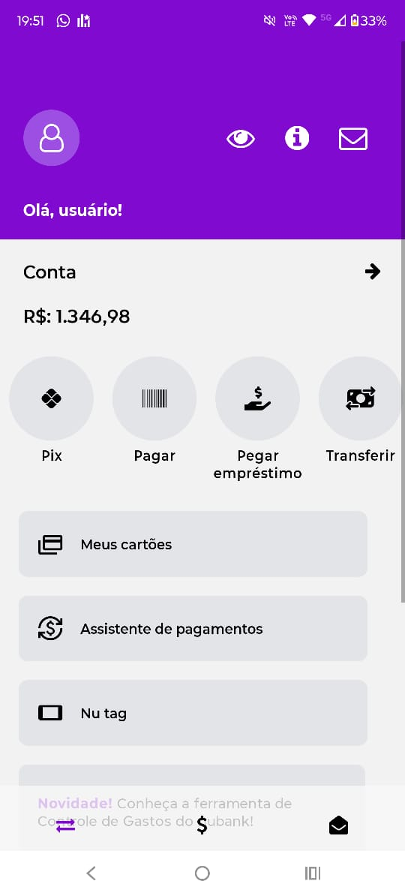
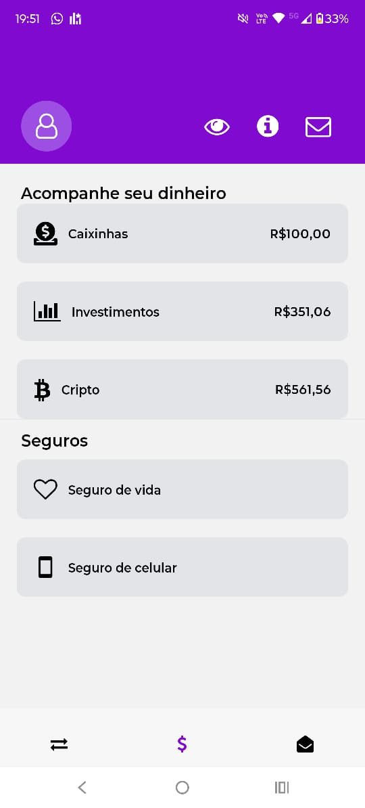
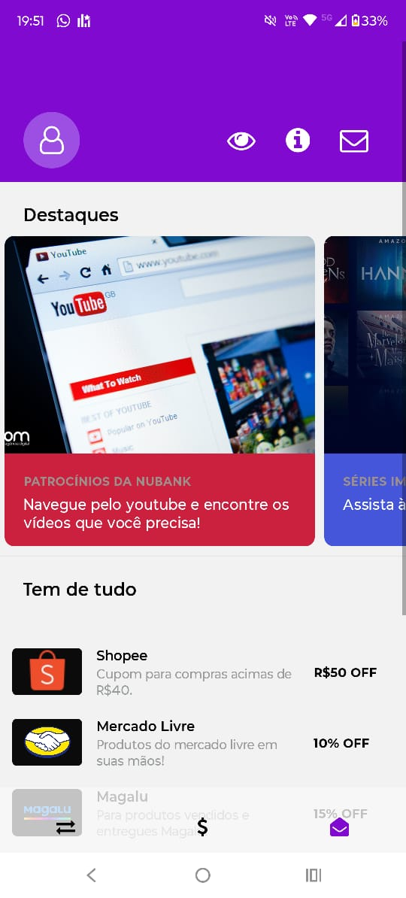
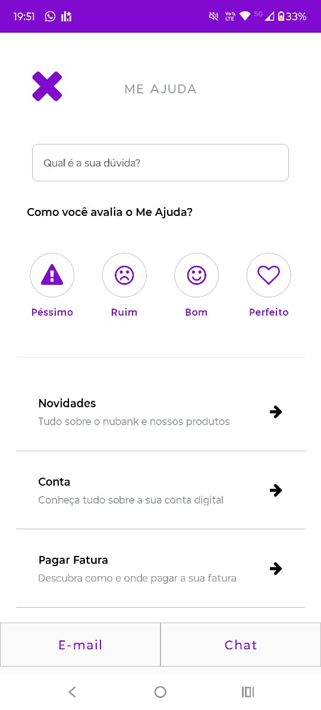

Clone da interface do aplicativo Nubank desenvolvido com React Native. O projeto replica as principais funcionalidades visuais do app, incluindo:

    Telas principais: Home (conta), Investimentos, Ofertas e Me Ajuda
    
    Recursos implementados:
        Toggle para mostrar/esconder saldo bancário
        Navegação por tabs inferior com efeito blur
        Scroll horizontal de funcionalidades (Pix, Pagar, Empréstimos etc.)
        Seções de cartão de crédito, novidades e promoções
        Página de ajuda com FAQ pesquisável
    Tecnologias utilizadas:
        Expo Router para navegação
        React Native Vector Icons
        Expo Blur para efeitos visuais
        Componentes React Native (ScrollView, FlatList, SafeAreaView)
        Estilização com StyleSheet
        
O projeto demonstra técnicas de desenvolvimento mobile com foco em UI/UX, componentes reutilizáveis e gestão de estado básica.

Algumas imagens tiradas da inferface gráfica:

  
    
     
    Tela inicial
  
  
    
     
    Investimentos
  
  
    
     
    Publicidade
  
  
    
     
    Tela de ajuda
  

